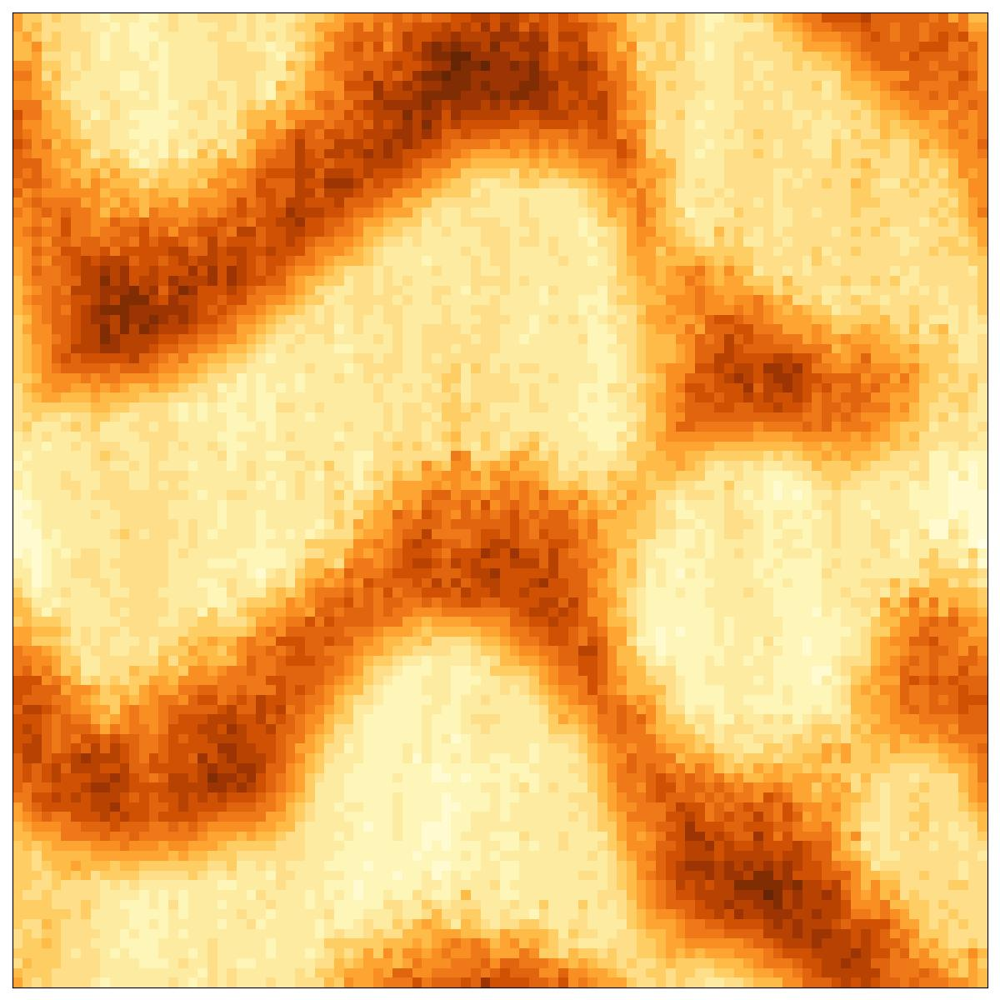
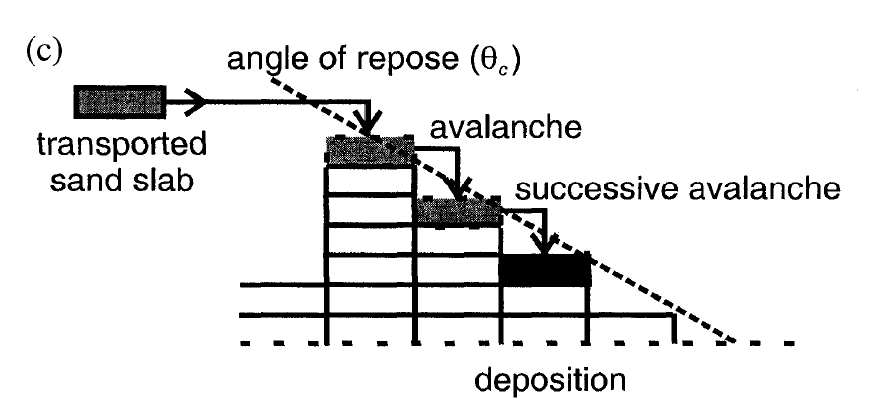

# Desert sand dune Cellular Automata


Different CA modelling the development of sand dunes. 

<!--  -->


## Other Models

Different approaches have been covered in the `other-models` directory. 

1. `werner1995.py` is the first model of this kind originally described by B. T. Werner (1995) [^1].
2. `werner1995-XXX.py` include modifications like using a Moore neighborhood or erosion condition modifications, described by Jim Elder[^2].
3. `momiji2000.py` includes linear and non-linear wind speedup effects and that sand in the shadow is stored, introduced by Momiji et al. (2002)[^3].
4. `bishop2002.py` modifies the wind speedup effect. [^4]


## Main Model

`dune-2D.py` and `dune-3D.py` additionally includes a parameter for different wind directions. Bishop et al. (2002) described a multidirectional wind model by using a rotation matrix. In my approach I'm falling back on simply to a normal distribution of the transport direction, this however neglects the individual shadows for different wind directions, but uses the mean wind direction. Many other parameters were adapted from Bishop et al. (2002)[^4].


## Usage

Example usage looks like
```shell
python3 dune-2D.py --num-frames 500 --steps-per-frame 1000 --grid-size 200
```


### Requirements

- `numpy`, `matplotlib`, `tqdm`

### Options

| Option                           | Description                                                     |
|-----------------------------------|-----------------------------------------------------------------|
| `-h`, `--help`                    | Show this help message and exit                                 |
| `--num-frames NUM_FRAMES`         | Number of frames                                                |
| `--steps-per-frame STEPS_PER_FRAME`| Steps per frame                                                 |
| `--grid-size GRID_SIZE`           | Grid size                                                       |
| `--uniform-initialization UNIFORM_INITIALIZATION` | Uniform initialization: True / Randomized: False      |
| `--H H`                           | Average initialization height                                   |
| `--delta-H DELTA_H`               | Max deviation for randomized initialization                     |
| `--delta-avalanche DELTA_AVALANCHE`| Height difference that causes an avalanche                     |
| `--shadow-angle SHADOW_ANGLE`     | Shadow angle                                                    |
| `--l-coeff0 L_COEFF0`             | Hop coefficient: constant ~ minimum length                      |
| `--l-coeff1 L_COEFF1`             | Hop coefficient: linear ~ dune slope                            |
| `--l-coeff2 L_COEFF2`             | Hop coefficient: quadratic ~ dune height                        |
| `--wind-std WIND_STD`             | Wind standard deviation (degrees)                               |
| `--p-sand P_SAND`                 | Probability of hopping sand being stored on sand                |
| `--p-surface P_SURFACE`           | Probability of hopping sand being stored on stone               |
| `--p-shadow P_SHADOW`             | Probability of hopping sand being stored in shadow (Overrides sand and stone probabilities) |
| `--p-shadow-erosion P_SHADOW_EROSION`| Probability of erosion/avalanches in shadow                   |
| `--restore-file RESTORE_FILE`     | Restore a previous state                                        |


### More Examples 
 


## Background

The following graphics are also taken from [^4].




## Bibliography

 [^1]: [Werner, B.T., 1995. Eolian dunes: computer simulations and attractor interpretation. Geology, 23(12), pp.1107-1110.](https://pubs.geoscienceworld.org/gsa/geology/article-abstract/23/12/1107/206230/Eolian-dunes-Computer-simulations-and-attractor)
 [^2]: [Elder, J. Models of dune field morphology](https://smallpond.ca/jim/sand/dunefieldMorphology/index.html)
 [^3]: [Momiji, H., Nishimori, H. and Bishop, S.R., 2002. On the shape and migration speed of a proto‐dune. Earth Surface Processes and Landforms: The Journal of the British Geomorphological Research Group, 27(12), pp.1335-1338.](https://onlinelibrary.wiley.com/doi/abs/10.1002/esp.410)
 [^4]: [Bishop, S.R., Momiji, H., Carretero-González, R. and Warren, A., 2002. Modelling desert dune fields based on discrete dynamics. Discrete Dynamics in Nature and Society, 7(1), pp.7-17.](https://onlinelibrary.wiley.com/doi/abs/10.1080/10260220290013462)

